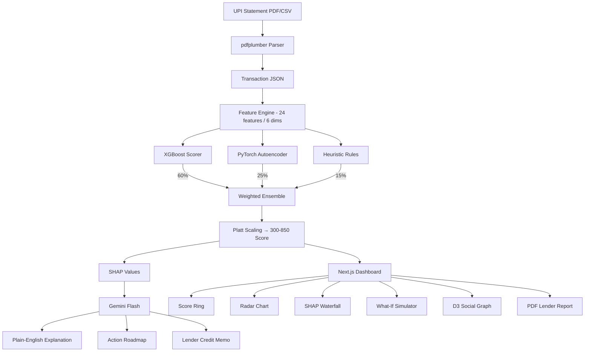

# INSTRUCTIONS.md — PulseCredit Feature Implementation Guide
# Read CLAUDE.md first. This file adds implementation detail on top of it.
# When implementing any feature, find its section here and follow exactly.

---

## SECTION 1: PDF PARSER (pdf_parser.py)

### Supported bank formats
Each bank has a different statement layout. The parser must detect format automatically.

```python
BANK_PATTERNS = {
    "HDFC": {
        "date_col": "Date",
        "narration_col": "Narration",
        "amount_col": "Amount",
        "type_col": "Withdrawal Amt.(INR)" / "Deposit Amt.(INR)",
        "date_format": "%d/%m/%y"
    },
    "SBI": {
        "date_col": "Txn Date",
        "narration_col": "Description",
        "amount_col": "Amount",
        "type_col": "Dr/Cr",
        "date_format": "%d %b %Y"
    },
    "ICICI": {
        "date_col": "Transaction Date",
        "narration_col": "Transaction Remarks",
        "amount_col": "Amount (INR)",
        "type_col": "CR/DR",
        "date_format": "%d/%m/%Y"
    },
    "KOTAK": {
        "date_col": "Date",
        "narration_col": "Description",
        "amount_col": "Amount (INR)",
        "type_col": "Cr/Dr",
        "date_format": "%d-%m-%Y"
    }
}
```

### VPA extraction from narration
```python
# UPI VPAs appear in narration as: "UPI/username@bank/remarks/UTR"
VPA_REGEX = r'[a-zA-Z0-9._-]+@[a-zA-Z0-9]+'

# Merchant classification from VPA
KNOWN_MERCHANTS = {
    "zomato@": "Zomato", "swiggy@": "Swiggy", "uber@": "Uber",
    "ola@": "Ola", "amazon@": "Amazon", "flipkart@": "Flipkart",
    "paytm@": "Paytm", "phonepe@": "PhonePe"
}

# Category from merchant
MERCHANT_CATEGORIES = {
    "Zomato": "food", "Swiggy": "food",
    "Uber": "transport", "Ola": "transport", "Rapido": "transport",
    "Amazon": "shopping", "Flipkart": "shopping",
    # rent: detect by remarks containing "rent", "room", "pg", "hostel"
    # education: detect by remarks containing "fee", "college", "tuition"
}
```

---

## SECTION 2: FEATURE ENGINEERING (feature_engine.py)

### Dimension 1: Payment Rhythm (4 features)

```python
def compute_rhythm_features(transactions_df):
    # F1: Coefficient of Variation of inter-transaction gaps (days between DRs)
    dr_dates = transactions_df[transactions_df.direction == 'DR'].txn_date.sort_values()
    gaps = dr_dates.diff().dt.days.dropna()
    rhythm_cov = gaps.std() / gaps.mean()   # lower = more regular
    
    # F2: Longest consecutive-day streak with at least one DR transaction
    # (shows sustained activity pattern)
    
    # F3: Rolling 7-day / 30-day transaction count ratio
    # (shows whether user is active recently vs historically)
    
    # F4: FFT-based weekly seasonality index
    # (high power at 7-day frequency = regular weekly pattern = good)
    from scipy.fft import fft
    daily_counts = transactions_df.groupby('txn_date').size().reindex(full_date_range, fill_value=0)
    fft_vals = np.abs(fft(daily_counts.values))
    weekly_power = fft_vals[len(fft_vals) // 7]    # power at weekly frequency
    
    return {"rhythm_cov": rhythm_cov, "streak": streak, "recency_ratio": ratio, "weekly_fft": weekly_power}
```

### Dimension 2: Merchant Consistency (4 features)

```python
def compute_merchant_features(transactions_df):
    # F5: Herfindahl-Hirschman Index on merchant spend share
    # HHI = sum of squared market shares. Range 0-1. Higher = more concentrated = more consistent
    merchant_spend = transactions_df.groupby('merchant_name')['amount'].sum()
    total = merchant_spend.sum()
    shares = (merchant_spend / total)
    hhi = (shares ** 2).sum()
    
    # F6: Top-5 merchant retention across months
    # Do the same 5 merchants appear in all 3 months? High overlap = consistent
    
    # F7: Category entropy
    # Shannon entropy of category distribution — lower = more stable lifestyle
    from scipy.stats import entropy
    cat_dist = transactions_df.groupby('category').size() / len(transactions_df)
    cat_entropy = entropy(cat_dist)
    
    # F8: Recurring merchant count
    # Merchants appearing in ALL 3 months at least once
    
    return {"merchant_hhi": hhi, "retention_rate": ret, "category_entropy": cat_entropy, "recurring_count": rec}
```

### Dimension 3: Social Trust Graph (4 features)

```python
def compute_social_features(transactions_df):
    # Build NetworkX directed graph
    # Nodes: user + all counterparty VPAs
    # Edges: DR = user→counterparty, CR = counterparty→user
    import networkx as nx
    G = nx.DiGraph()
    for _, row in transactions_df.iterrows():
        if row.direction == 'DR':
            G.add_edge('USER', row.vpa, weight=row.amount, count=1)
        else:
            G.add_edge(row.vpa, 'USER', weight=row.amount, count=1)
    
    # F9: Unique inbound VPA count (unique people who sent money TO user)
    unique_senders = len([v for v in G.predecessors('USER')])
    
    # F10: Inbound-to-outbound sender ratio
    unique_receivers = len([v for v in G.successors('USER')])
    sender_ratio = unique_senders / max(unique_receivers, 1)
    
    # F11: Reciprocity score
    # Contacts who appear on BOTH sides (user sends to them AND receives from them)
    senders = set(G.predecessors('USER'))
    receivers = set(G.successors('USER'))
    reciprocal = len(senders.intersection(receivers)) / max(len(senders.union(receivers)), 1)
    
    # F12: User degree centrality in full graph
    centrality = nx.degree_centrality(G).get('USER', 0)
    
    # Return graph JSON for D3 visualization:
    # {"nodes": [{"id": vpa, "size": tx_count}], "links": [{"source": ..., "target": ..., "value": amount}]}
    
    return {"unique_senders": unique_senders, "sender_ratio": sender_ratio, "reciprocity": reciprocal, "centrality": centrality}
```

### Dimension 4: Calendar Alignment (4 features)

```python
INDIAN_FESTIVALS = {
    "diwali": ["2024-11-01", "2025-10-20"],
    "holi":   ["2024-03-25", "2025-03-14"],
    "eid":    ["2024-04-10", "2025-03-31"],
    "navratri": ["2024-10-03", "2025-09-22"]
}

SEMESTER_MONTHS = [1, 2, 7, 8]  # Jan, Feb (spring start), Jul, Aug (fall start)

def compute_calendar_features(transactions_df):
    # F13: Semester boundary detection
    # Check if large CRs (salary/stipend) appear in months 1,2,7,8
    # Score = fraction of SEMESTER_MONTHS with a large CR
    
    # F14: Stipend fingerprint
    # Large CR on same day (±3) each month = fixed income pattern
    monthly_large_cr = transactions_df[
        (transactions_df.direction == 'CR') & (transactions_df.amount > 2000)
    ].groupby(transactions_df.txn_date.dt.month)['txn_date'].apply(lambda x: x.dt.day.mode()[0])
    day_std = monthly_large_cr.std()   # low std = fixed date = good
    
    # F15: Rent regularity
    # Transactions with "rent"/"room"/"pg" in remarks — how regularly do they appear?
    
    # F16: Festival spike normalization
    # Large spikes near festival dates are EXPECTED and should not penalize velocity
    # Mark transactions within 5 days of festival as "festival_tagged"
    
    return {"semester_score": sem, "stipend_regularity": 1/(1+day_std), "rent_regularity": rent, "festival_adjusted": adj}
```

### Dimension 5: Velocity Stability (4 features)

```python
def compute_velocity_features(transactions_df):
    # F17: Rolling 30-day spend Z-score
    monthly_spend = transactions_df[transactions_df.direction == 'DR'].groupby(
        transactions_df.txn_date.dt.to_period('M')
    )['amount'].sum()
    zscore = abs(stats.zscore(monthly_spend)).mean()   # lower = more stable
    
    # F18: Month-over-month spend delta coefficient
    mom_changes = monthly_spend.pct_change().abs().dropna()
    mom_delta = mom_changes.mean()
    
    # F19: Outlier transaction detection
    # Any single DR > mean + 3*std is flagged (NOT festival-tagged)
    mean_dr = transactions_df[transactions_df.direction=='DR']['amount'].mean()
    std_dr  = transactions_df[transactions_df.direction=='DR']['amount'].std()
    outlier_count = len(transactions_df[
        (transactions_df.direction=='DR') &
        (transactions_df.amount > mean_dr + 3*std_dr) &
        (~transactions_df.festival_tagged)
    ])
    
    # F20: Micro-splitting detection (suspicious pattern)
    # 3+ transactions to same VPA on same day = could indicate structuring
    daily_vpa = transactions_df.groupby(['txn_date','vpa']).size()
    micro_split_count = (daily_vpa >= 3).sum()
    
    return {"zscore": zscore, "mom_delta": mom_delta, "outlier_count": outlier_count, "micro_split": micro_split_count}
```

### Dimension 6: NLP Intent Score (4 features)

```python
def compute_nlp_features(transactions_df, gemini_client):
    # F21: Productive keyword ratio (spaCy)
    PRODUCTIVE_KEYWORDS = ["fees", "tuition", "rent", "hostel", "medicine", "hospital",
                           "books", "stationery", "insurance", "emi", "loan"]
    IMPULSIVE_KEYWORDS  = ["party", "pub", "casino", "bet", "gaming", "recharge"]
    
    remarks_text = " ".join(transactions_df.remarks.dropna().tolist()).lower()
    productive_hits = sum(remarks_text.count(kw) for kw in PRODUCTIVE_KEYWORDS)
    impulsive_hits  = sum(remarks_text.count(kw) for kw in IMPULSIVE_KEYWORDS)
    total_hits = productive_hits + impulsive_hits
    productive_ratio = productive_hits / max(total_hits, 1)
    
    # F22: spaCy NER — detect ORG entities in remarks (named businesses = intentional spending)
    import spacy
    nlp = spacy.load("en_core_web_sm")
    all_remarks = " ".join(transactions_df.remarks.dropna())
    doc = nlp(all_remarks)
    org_count = len([ent for ent in doc.ents if ent.label_ == "ORG"])
    
    # F23: Ambiguous note classification via Gemini
    # Send batch of 10 most ambiguous remarks to Gemini for classification
    # Only call if productive_ratio is in 0.4-0.6 range (genuinely ambiguous)
    
    # F24: Average remark length
    # Longer notes = more intentional spending (people who write "canteen lunch" think about money)
    avg_remark_len = transactions_df.remarks.dropna().str.len().mean()
    
    return {"productive_ratio": productive_ratio, "org_density": org_count/len(transactions_df),
            "gemini_intent": gemini_score, "remark_richness": min(avg_remark_len/50, 1.0)}
```

---

## SECTION 3: ENSEMBLE LOGIC (ensemble.py)

```python
def compute_ensemble_score(xgb_raw, ae_reconstruction_error, heuristic_score, ae_error_threshold):
    """
    ae_reconstruction_error: float, MSE of autoencoder reconstruction
    ae_error_threshold: float, mean + 2*std of training errors (loaded from model artifacts)
    """
    
    # Normalize AE error to 0-1 novelty signal (0 = very normal, 1 = very unusual)
    ae_novelty = min(ae_reconstruction_error / ae_error_threshold, 1.0)
    
    # AE novelty is ambiguous — unusual could be very good OR very bad
    # XGBoost determines the direction; AE adjusts magnitude
    ae_contribution = ae_novelty * (1 if xgb_raw > 0.5 else -1) * 0.25
    
    raw_blend = (xgb_raw * 0.60) + ae_contribution + (heuristic_score * 0.15)
    
    # Map to 300-850
    pulse_score = int(300 + (raw_blend * 550))
    pulse_score = max(300, min(850, pulse_score))
    
    # Confidence interval: ±30 base, narrows with more data
    return pulse_score, pulse_score - 30, pulse_score + 30
```

---

## SECTION 4: FRONTEND COMPONENTS

### ScoreRing.tsx
```typescript
// Uses Framer Motion to animate the ring from 0 to final score on mount
// SVG circle with stroke-dasharray calculated as: circumference * (score - 300) / 550
// Color: red (#E24B4A) < 600 | amber (#BA7517) 600-699 | green (#1D9E75) 700+
// Center text: score number (large) + band label (small below)
// Animation: 1.5s ease-out on initial render
```

### WhatIfSimulator.tsx
```typescript
// 6 sliders, one per behavioral dimension
// Each slider: 0-100, step=1, labeled with dimension name
// On change: debounce 300ms → POST /api/simulate with overrides
// Show: current radar (blue) + projected radar (green, dashed) side-by-side
// Show: score delta with +/- indicator and color
// Show: "In 3 months" projection: if projected score maintained, show trajectory
```

### SocialGraph.tsx
```typescript
// D3 force simulation
// Nodes: "USER" (large, purple) + VPA contacts (sized by transaction frequency)
// Edges: blue = user paid them, green = they paid user, purple = reciprocal
// On hover node: show VPA, total sent/received, relationship type
// Cluster detection: contacts who transact with each other form visible clusters
// This is the most visually impressive component — spend time on it
```

### SHAPWaterfall.tsx
```typescript
// Recharts BarChart, horizontal orientation
// Each bar = one SHAP feature, sorted by absolute value descending
// Positive SHAP (green bar, right): "this feature HELPED your score"
// Negative SHAP (red bar, left): "this feature HURT your score"
// Label on each bar: feature human-readable name + value
// Base score line at center (what XGBoost starts from before features)
```

---

## SECTION 5: STATE MANAGEMENT (lib/store.ts)

```typescript
// Zustand store shape
interface PulseCreditStore {
  // Current profile
  profileId: string | null
  transactions: Transaction[]
  dimensions: DimensionScores
  score: ScoreResult | null
  
  // UI state
  isLoading: boolean
  activePersona: 'ravi' | 'priya' | 'arjun' | null
  
  // Simulator state
  simulatorOverrides: Partial<DimensionScores>
  simulatedScore: ScoreResult | null
  
  // Actions
  setProfileId: (id: string) => void
  setScore: (score: ScoreResult) => void
  setSimulatorOverride: (dim: string, value: number) => void
  resetSimulator: () => void
  loadPersona: (persona: 'ravi' | 'priya' | 'arjun') => void
}
```

---

## SECTION 6: ENV VARIABLES (.env.example)

```bash
# Backend
GEMINI_API_KEY=your_gemini_flash_api_key_here
SUPABASE_URL=https://your-project.supabase.co
SUPABASE_SERVICE_KEY=your_supabase_service_role_key
MODEL_PATH=./models/model.pkl
AUTOENCODER_PATH=./models/autoencoder.pt
ENVIRONMENT=development   # or production

# Frontend  
NEXT_PUBLIC_API_URL=http://localhost:8000   # Render URL in production
NEXT_PUBLIC_SUPABASE_URL=https://your-project.supabase.co
NEXT_PUBLIC_SUPABASE_ANON_KEY=your_supabase_anon_key
```

---

## SECTION 7: GITHUB ACTIONS (deploy.yml)

```yaml
name: Deploy PulseCredit
on:
  push:
    branches: [main]
jobs:
  deploy-backend:
    runs-on: ubuntu-latest
    steps:
      - uses: actions/checkout@v4
      - name: Deploy to Render
        run: curl -X POST ${{ secrets.RENDER_DEPLOY_HOOK }}
  deploy-frontend:
    runs-on: ubuntu-latest
    steps:
      - uses: actions/checkout@v4
      - name: Deploy to Vercel
        run: npx vercel --prod --token=${{ secrets.VERCEL_TOKEN }}
```

---

## SECTION 8: README MERMAID DIAGRAM



---

## SECTION 9: COMMON ERRORS AND FIXES

| Error | Cause | Fix |
|-------|-------|-----|
| Score returns > 850 | Platt scaling overflowed | Clamp: `max(300, min(850, score))` |
| Gemini returns plain text not JSON | Prompt missing JSON instruction | Add `"Return ONLY valid JSON, no markdown"` to all prompts |
| AE loss not decreasing | Training on all profiles including defaulted | Train AE on NORMAL profiles only |
| SHAP fails on single sample | SHAP needs background data | Pass `shap.TreeExplainer(model, data=X_train_sample)` |
| D3 graph crashes on empty social data | User has 0 CRs | Guard: if unique_senders == 0, show placeholder "No inbound transfers found" |
| /api/simulate returns in >500ms | Re-running full pipeline | Cache feature vector in memory, only re-run ensemble layer |
| pdfplumber returns empty text | Scanned PDF (image-based) | Detect via `len(page.extract_text()) == 0`, return error: "Please upload a text-based PDF statement" |
| spaCy model not found | en_core_web_sm not downloaded | Add to startup: `python -m spacy download en_core_web_sm` |
