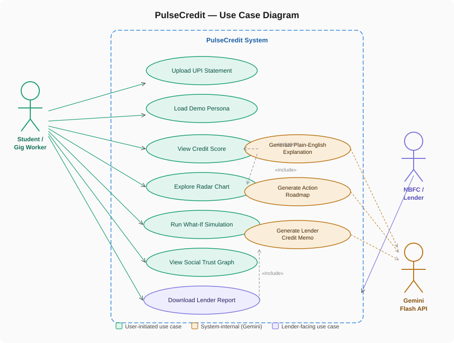
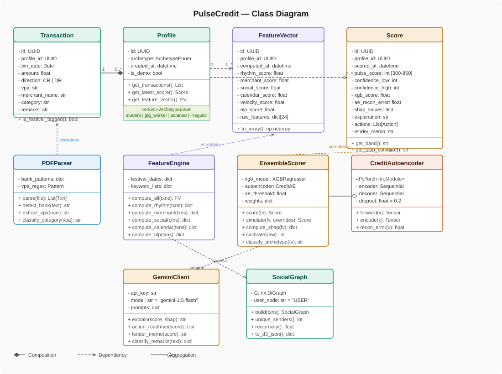
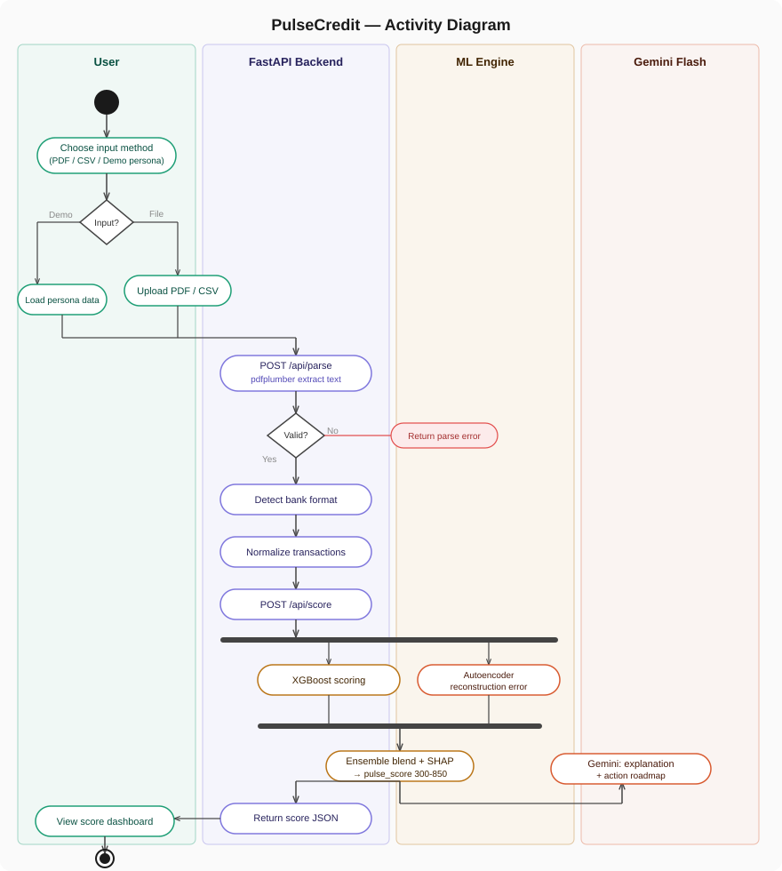
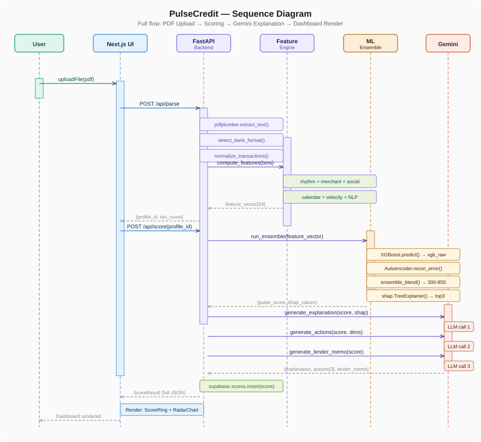
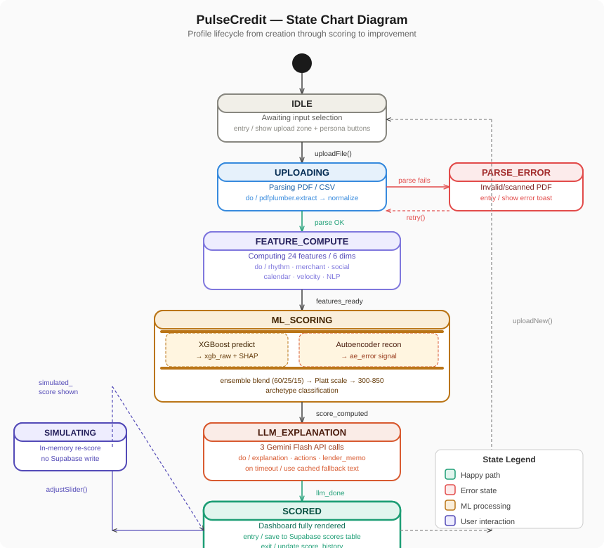
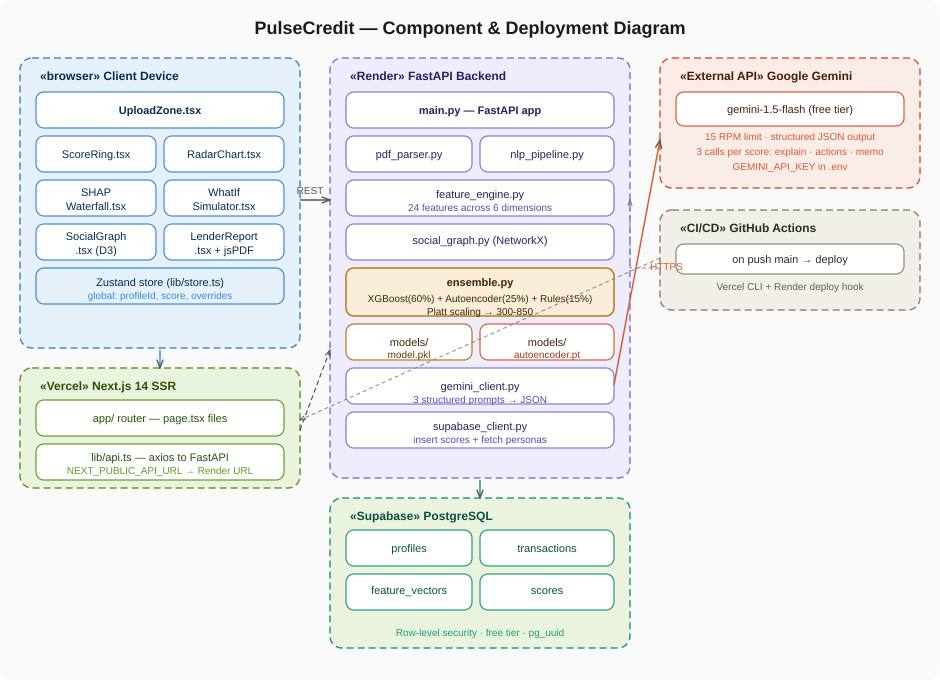

# PulseCredit

**Behavioral alternative credit scoring for India's 350M credit-invisible population**

A full-stack web platform that scores creditworthiness based on UPI transaction patterns using ML ensemble + LLM explanations.

## 🎯 Overview

PulseCredit solves a critical problem: 45% of Indian adults have never checked their credit score, and 350M are credit-invisible to formal systems despite being creditworthy based on their actual transaction behavior.

**Architecture:**
- **Frontend**: Next.js 14 + React 18 + Recharts + D3 + Framer Motion
- **Backend**: FastAPI + Python ML stack
- **ML**: XGBoost (60%) + PyTorch Autoencoder (25%) + Heuristic Rules (15%)
- **LLM**: Gemini Flash 1.5 (3 structured prompts)
- **Database**: Supabase PostgreSQL
- **Deployment**: Vercel (frontend) + Render (backend)

## 🚀 Quick Start

### Prerequisites
- Python 3.11.x
- Node.js 18+
- Gemini API key (free tier)
- Supabase account (free tier)

### Team Default Backend Bootstrap

Use the bootstrap script from repo root. This is the default team workflow and avoids local interpreter drift.

Windows PowerShell:

```powershell
./scripts/bootstrap_backend.ps1
```

macOS/Linux:

```bash
./scripts/bootstrap_backend.sh
```

Important: do not use Python 3.15 alpha environments for this project. Use `.venv-clean` created by the scripts.

### Backend Setup

```bash
# 1. Clone and navigate
git clone <repo-url>
cd pulse-credit

# 2. Bootstrap reproducible backend env (.venv-clean)
# Windows: ./scripts/bootstrap_backend.ps1
# macOS/Linux: ./scripts/bootstrap_backend.sh

# 3. Activate environment manually (optional)
# Windows: ./.venv-clean/Scripts/Activate.ps1
# macOS/Linux: source .venv-clean/bin/activate
# Set helper for commands below:
# Windows: VENV_PY=.venv-clean/Scripts/python.exe
# macOS/Linux: VENV_PY=.venv-clean/bin/python

# 4. Download spaCy model
$VENV_PY -m spacy download en_core_web_sm

# 5. Set environment variables
cp .env.example .env
# Edit .env with your API keys

# 6. Train models (generates 1,000 synthetic profiles + trains XGBoost + AE)
$VENV_PY backend/train.py

# 7. Start FastAPI server
cd backend
$VENV_PY -m uvicorn main:app --reload
```

FastAPI runs on `http://localhost:8000`
Docs: `http://localhost:8000/docs`

### Frontend Setup

```bash
# 1. Navigate to frontend
cd frontend

# 2. Install dependencies
npm install

# 3. Set environment variables
# Create .env.local with:
NEXT_PUBLIC_API_URL=http://localhost:8000
NEXT_PUBLIC_SUPABASE_URL=<your-supabase-url>
NEXT_PUBLIC_SUPABASE_ANON_KEY=<your-anon-key>

# 4. Start dev server
npm run dev
```

Next.js runs on `http://localhost:3000`

## 📊 Features

### 6 Behavioral Dimensions (24 Features)
1. **Payment Rhythm** - Regularity of transactions (CoV, streak, FFT seasonality)
2. **Merchant Consistency** - Lifestyle patterns (HHI, retention, category entropy)
3. **Social Trust** - Contact network analysis (NetworkX graph metrics)
4. **Calendar Alignment** - Temporal patterns (semester, stipend, rent)
5. **Velocity Stability** - Spend volatility (Z-scores, month-over-month changes)
6. **NLP Intent** - Productive vs impulsive spending (spaCy + Gemini classification)

### ML Pipeline
- **XGBoost**: 300 trees, max_depth=5 → Primary scorer + SHAP values
- **PyTorch Autoencoder**: 24→12→6→12→24 architecture → Anomaly detection
- **Ensemble Blend**: 60% XGBoost + 25% AE novelty + 15% heuristic rules
- **Output**: 300-850 score range with confidence interval

### LLM Explanations (Gemini Flash 1.5)
1. **Plain-English**: 2-sentence score explanation
2. **Action Roadmap**: 3 specific, timestamped improvement actions with score deltas
3. **Lender Memo**: 150-word structured narrative for NBFCs

### 3 Demo Personas
- **Ravi** (student, ~612): Daily ₹50 canteen, strong rhythm
- **Priya** (gig worker, ~571): Erratic Swiggy earnings
- **Arjun** (improving, ~701): 3-month improving trajectory

## 📁 Project Structure

```
pulsecredit/
├── backend/
│   ├── main.py                  # FastAPI app
│   ├── feature_engine.py        # All 24 features → 6 dimensions
│   ├── ensemble.py              # XGBoost + AE + heuristics
│   ├── autoencoder.py           # PyTorch model
│   ├── train.py                 # Training pipeline
│   ├── gemini_client.py         # 3 LLM prompts
│   ├── pdf_parser.py            # Multi-bank PDF/CSV parser
│   ├── synthetic_data.py        # 1,000 profile generator
│   ├── models/                  # Trained models (generated by train.py)
│   ├── data/                    # Datasets
│   └── requirements.txt
├── frontend/
│   ├── app/
│   │   ├── layout.tsx
│   │   ├── page.tsx             # Landing page
│   │   ├── dashboard/page.tsx   # Score display
│   │   ├── simulate/page.tsx    # What-if simulator
│   │   └── globals.css
│   ├── components/
│   │   ├── ScoreRing.tsx        # Animated ring
│   │   ├── RadarChart.tsx       # 6-axis radar
│   │   ├── SHAPWaterfall.tsx    # Feature impact
│   │   ├── ActionRoadmap.tsx    # 3 improvement cards
│   │   └── ...
│   ├── lib/
│   │   ├── store.ts             # Zustand store
│   │   ├── api.ts               # Axios client
│   │   └── ...
│   └── package.json
├── db/
│   └── migrations/
│       └── 001_initial_schema.sql
├── .env.example
├── CLAUDE.md                    # Master spec
├── INSTRUCTIONS.md              # Implementation guide
└── README.md
```

## 🔧 API Endpoints

### POST `/api/parse`
Parse UPI statement (PDF/CSV)
```json
{
  "profile_id": "uuid",
  "transaction_count": 87,
  "date_range": {"start": "2024-01-01", "end": "2024-03-31"},
  "transactions": [...]
}
```

### POST `/api/score`
Compute full credit score with explanations
```json
{
  "pulse_score": 657,
  "confidence_interval": [627, 687],
  "band": "good",
  "dimensions": {"rhythm": 72, "merchant": 65, ...},
  "explanation": "Your ₹50 daily canteen payments...",
  "actions": [{"action": "...", "delta": 18, "priority": 1}, ...],
  "lender_memo": "..."
}
```

### POST `/api/simulate`
What-if simulation (DB-backed base profile, strict Supabase mode)
```json
{
  "base_score": 650,
  "simulated_score": 680,
  "delta": 30
}
```

### GET `/api/personas`
Get 3 demo personas with full score data

### GET `/api/report/{profile_id}`
Download PDF lender report

## 🏗 Database Schema

**Supabase PostgreSQL** (free tier)

```sql
-- profiles: one row per scored user
CREATE TABLE profiles (
  id UUID PRIMARY KEY,
  archetype TEXT,
  is_demo BOOLEAN,
  created_at TIMESTAMPTZ
);

-- transactions: raw UPI data
CREATE TABLE transactions (
  id UUID PRIMARY KEY,
  profile_id UUID REFERENCES profiles,
  txn_date DATE,
  amount NUMERIC,
  direction TEXT,  -- 'CR' or 'DR'
  vpa TEXT,        -- UPI ID
  merchant_name TEXT,
  category TEXT,
  remarks TEXT
);

-- feature_vectors: computed dimensions
CREATE TABLE feature_vectors (
  id UUID PRIMARY KEY,
  profile_id UUID UNIQUE REFERENCES profiles,
  rhythm_score NUMERIC,
  merchant_score NUMERIC,
  ...
  raw_features JSONB
);

-- scores: final credit scores
CREATE TABLE scores (
  id UUID PRIMARY KEY,
  profile_id UUID UNIQUE REFERENCES profiles,
  pulse_score INTEGER,
  shap_values JSONB,
  explanation TEXT,
  actions JSONB,
  lender_memo TEXT
);
```

## 🎨 UI Components

- **ScoreRing**: Framer Motion animated ring (0→score over 1.5s)
- **RadarChart**: Recharts 6-axis behavioral radar
- **SHAPWaterfall**: Horizontal bar chart showing top 3 feature impacts
- **ActionRoadmap**: 3 priority cards with improvement predictions
- **WhatIfSimulator**: 6 sliders for what-if scenarios (< 200ms response)
- **SocialGraph**: D3 force-directed transaction network (optional)

## 🔐 Environment Variables

```bash
# Backend
GEMINI_API_KEY=sk-...
SUPABASE_URL=https://xxx.supabase.co
SUPABASE_SERVICE_KEY=eyJ...
MODEL_PATH=./backend/models/model.pkl
AUTOENCODER_PATH=./backend/models/autoencoder.pt

# Frontend
NEXT_PUBLIC_API_URL=http://localhost:8000
NEXT_PUBLIC_SUPABASE_URL=https://xxx.supabase.co
NEXT_PUBLIC_SUPABASE_ANON_KEY=eyJ...
```

Notes:
- `SUPABASE_URL` and `SUPABASE_SERVICE_KEY` are mandatory in strict DB mode. Backend startup fails fast if either is missing.
- If `GEMINI_API_KEY` is invalid, Gemini is disabled once per process and fallback narratives are used without per-request log spam.

## 📈 Performance Targets

- `/api/parse`: < 2 seconds (PDF parsing + feature compute)
- `/api/score`: < 1 second (ML ensemble + SHAP + Gemini)
- `/api/simulate`: < 200ms (cached features, ensemble only)
- Dashboard load: < 500ms
- Gemini API: 15 RPM limit (free tier)

## 🚁 Deployment

### Render (Backend)
1. Create account at render.com
2. Connect GitHub repo
3. Create Web Service
4. Set environment variables (secrets)
5. Deploy hook: `https://api.render.com/deploy/srv-xxx?key=yyy`

### Vercel (Frontend)
1. Import project from GitHub
2. Set environment variables
3. Deploy with `npm run build`
4. Automatic deployments on push to main

## 📊 Model Training

```bash
cd backend
python train.py
```

Generates:
- `models/model.pkl` (XGBoost - 5MB)
- `models/autoencoder.pt` (PyTorch AE - 1MB)
- `models/demo_personas.pkl` (3 personas)
- `models/feature_scaler.pkl`
- `data/synthetic_dataset.csv` (1,000 profiles)

## 🧪 Testing

```bash
# Backend
cd backend
pytest tests/

# Frontend
cd frontend
npm run test
```

CI additionally runs strict DB-mode smoke checks in [.github/workflows/deploy.yml](.github/workflows/deploy.yml):
- startup must fail when Supabase env vars are missing
- `/api/score` must persist rows to `profiles`, `transactions`, `feature_vectors`, `scores`
- `/api/simulate` must resolve the profile from DB-backed state

## 📌 Dependency Rationale

Backend uses `fastapi-slim==0.111.0` (instead of `fastapi`) to keep dependency resolution stable with `spacy==3.7.4` and `typer==0.9.4`.

Why this matters:
- `fastapi` pulls `fastapi-cli` versions that require newer `typer`
- `spacy` pins to `<0.10` typer range
- this mismatch caused clean install failures in new virtual environments

Do not switch back to `fastapi` unless you also re-evaluate the full `spacy` and `typer` compatibility matrix.

## 📝 Score Bands

| Score | Band | Indicative Loan |
|-------|------|-----------------|
| 750-850 | Excellent | ₹1,00,000 |
| 700-749 | Very Good | ₹50,000 |
| 650-699 | Good | ₹25,000 |
| 600-649 | Fair | ₹10,000 |
| 300-599 | Poor | ₹5,000 (with monitoring) |


## 🧭 Diagrams

### 1. Use Case Diagram



### 2. Class Diagram



### 3. Activity Diagram



### 4. Sequence Diagram



### 5. Statechart Diagram



### 6. Component and Deployment Diagram




## 📄 License

MIT

---

**Built for Tech Builders 2026 Hackathon**
**Deadline**: April 17, 2026 @ 2:30 AM IST
